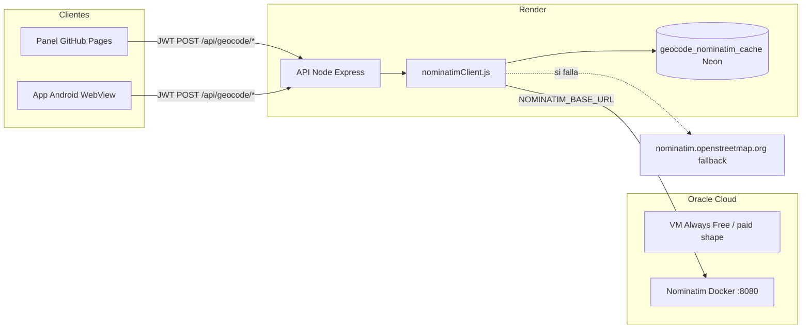

# Nominatim en Oracle Cloud — geocodificación y reverse geocoding

**Documentación técnica** · Integración con la API GestorNova (Render) y el panel / bot WhatsApp.

---

## 1. Resumen

GestorNova **no** llama a Nominatim desde el navegador ni desde la app Android de forma directa hacia internet abierto. El flujo es:

1. **Panel web** o **app** → `POST /api/geocode/nominatim/search` o `POST /api/geocode/nominatim/reverse` (JWT).
2. **API Node en Render** → `api/services/nominatimClient.js` (throttle, cabeceras, reintentos, fallback).
3. **Instancia propia Nominatim** en **Oracle Cloud Infrastructure (OCI)** — VM con Docker, puerto **8080** (HTTP).
4. Endpoints estándar OSM: **`/search`** (dirección → coordenadas) y **`/reverse`** (coordenadas → dirección).

Si la instancia Oracle no responde, el cliente puede reintentar y, en último caso, usar **`https://nominatim.openstreetmap.org`** (solo como respaldo; en producción se prioriza Oracle).

| Concepto | Valor de referencia (migración 2026) |
|---------|--------------------------------------|
| Host anterior (Vultr) | `http://45.76.3.146:8080` |
| Host actual (Oracle) | `http://167.234.235.76:8080` |
| Variable en Render | `NOMINATIM_BASE_URL` (sin barra final) |
| HTTPS opcional | Caddy + dominio propio (`ORACLE_HTTPS_SETUP.md`) |

---

## 2. Arquitectura



**Código clave:**

| Componente | Ruta |
|----------|------|
| Rutas HTTP proxy | `api/routes/geocodeNominatim.js` |
| Cliente Nominatim (search/reverse, geocode estructurado) | `api/services/nominatimClient.js` |
| Caché BD respuestas proxy | `api/services/geocodeNominatimCache.js` |
| Pipeline pedidos / re-geocodificar | `api/services/geocodeWithFallback.js`, `api/services/regeocodificarPedido.js` |
| WhatsApp GPS → domicilio | `api/services/whatsapp-bot-gps-ubicacion.js` |
| Rate limit API | `api/middleware/rateLimits.js` → prefijo `/api/geocode` |

---

## 3. Reverse geocoding (coordenadas → dirección)

### 3.1 Qué hace

Dadas **latitud** y **longitud**, Nominatim devuelve un objeto con `display_name`, `address` (calle, ciudad, provincia, CP, etc.). La API expone:

| Método | Ruta | Auth |
|--------|------|------|
| `POST` | `/api/geocode/nominatim/reverse` | JWT (`authWithTenantHost`) |
| `GET` | `/api/geocode/health` | Público (diagnóstico; prueba `/search` contra `NOMINATIM_BASE_URL`) |

**Body típico (reverse):**

```json
{
  "lat": -31.7333,
  "lon": -60.5297,
  "zoom": 18
}
```

**Respuesta:**

```json
{
  "ok": true,
  "result": { "lat": "...", "lon": "...", "display_name": "...", "address": { ... } },
  "cached": false
}
```

La ruta usa `nominatimProxyReverseRaw` → instancia Oracle `GET /reverse?lat=…&lon=…&format=json&addressdetails=1&…`.

Función de servidor reutilizable: `reverseGeocodeArgentina(lat, lng)` en `nominatimClient.js` (bot, geocodificación estructurada, validación de localidad).

### 3.2 Dónde se usa reverse en el producto

| Uso | Capa | Descripción |
|-----|------|-------------|
| **Bot WhatsApp — ubicación GPS** | API | El vecino comparte ubicación; reverse infiere calle/localidad antes de confirmar el reclamo (`whatsapp-bot-gps-ubicacion.js`). |
| **Admin — clic en mapa (pedido nuevo)** | Front + API | Clic en el mapa → `POST /api/geocode/nominatim/reverse` → rellena calle, número, localidad (`app.js` / `map-view.js`, módulos `pedido-nuevo-reverse-geo.js`). |
| **Detalle pedido — provincia / CP** | Front + API | Si faltan provincia o código postal y hay coords, reverse vía API (`pedido-detalle-infer-ubicacion-nominatim.js`). |
| **Validación catálogo / geocode** | API | Tras obtener punto, reverse para comprobar que calle y localidad coinciden con el padrón (`reverseHitMatchesCatalog`, `reverseHitMatchesLocalidadSolo`). |
| **Geocodificación estructurada** | API | Pasos internos de `geocodeAddressArgentina` cuando necesitan ancla o verificación por reverse. |

### 3.3 Forward geocoding (dirección → coordenadas)

| Uso | Ruta / función |
|-----|----------------|
| Panel — búsqueda dirección | `POST /api/geocode/nominatim/search` |
| Alta pedido, corrección coords | `geocodeAddressArgentina`, `PUT /api/pedidos/:id/coords-manual`, `regeocodificarPedido` |
| Bot WhatsApp — domicilio texto/NIS | Pipeline en `pedidoWhatsappBot.js` + `nominatimClient` |
| Autocompletado calles (admin) | `api/routes/nominatimLookup.js` |

Documentación operativa y variables: `docs/NOMINATIM_WHATSAPP_OPERATIVA.md`, `docs/sistema-geocodificacion-estructurada.md`, `docs/GUIA_PRUEBAS_GEOCODIFICACION.md`.

---

## 4. Configuración en Render (API)

### 4.1 Variable obligatoria

```text
NOMINATIM_BASE_URL=http://167.234.235.76:8080
```

- **Sin** barra final.
- Tras cambiar: **Save** en Render → **redeploy** automático.

Detalle y rollback: `RENDER_ENV_VARS.md`, `MIGRATION_VULTR_TO_ORACLE.md`.

### 4.2 Variables recomendadas

| Variable | Uso |
|----------|-----|
| `NOMINATIM_USER_AGENT` | Identificador del cliente (política OSM si se usa fallback público). |
| `NOMINATIM_FROM_EMAIL` o `NOMINATIM_FROM` | Email de contacto en cabecera `From` (evita **HTTP 406** en algunos proxy Oracle si el email es inválido). |
| `NOMINATIM_ACCEPT` | Default `*/*`; opcional. |
| `NOMINATIM_FETCH_TIMEOUT_MS` | Timeout de `fetch` hacia Oracle. |
| `NOMINATIM_WHATSAPP_SEARCH_MODE` | p. ej. `free-form` para el pipeline del bot. |
| `NOMINATIM_HOUSE_PARITY_MAX_STEPS` | Intentos ±2, ±4… si el número de puerta no está en OSM. |
| `DISABLE_NOMINATIM` | `1` desactiva llamadas (solo diagnóstico). |
| `DEBUG_NOMINATIM` | Logs extra (no en producción). |

Plantilla completa: `api/.env.example`.

### 4.3 Comprobar desde Render

```http
GET https://<tu-api>.onrender.com/api/geocode/health
```

Respuesta incluye `nominatim_effective_base`, `nominatim_reachable`, latencia y muestra de `/search`.

---

## 5. Oracle Cloud — infraestructura

### 5.1 VM y red

- **Compute:** instancia OCI (referencia migración: IP pública `167.234.235.76`).
- **Puerto:** `8080` (HTTP directo al contenedor Nominatim o reverse proxy).
- **Security lists / firewall:** deben permitir tráfico entrante al puerto desde **Render** (salida dinámica de Render) o desde redes autorizadas. Si solo la VM puede salir pero no entrar desde internet, `curl` desde PC y la API fallarán con timeout — ver `MIGRATION_VERIFICATION.md`.

### 5.2 HTTPS (opcional)

1. Dominio con registro **A** a la IP de la VM.
2. Script: `scripts/oracle/setup_https_caddy.sh` (Caddy + Let's Encrypt).
3. Actualizar Render: `NOMINATIM_BASE_URL=https://nominatim.tu-dominio.com`
4. Redeploy API.

Guía: `ORACLE_HTTPS_SETUP.md`.

### 5.3 Operación en la VM

Pruebas manuales desde una red que alcance el host:

```bash
curl -sS "http://167.234.235.76:8080/search?q=Parana%20Entre%20Rios&format=json&limit=1" | head -c 800
curl -sS "http://167.234.235.76:8080/reverse?lat=-31.58&lon=-60.08&format=json&addressdetails=1" | head -c 800
```

Monitoreo: CPU/RAM en OCI Monitoring; logs del contenedor Docker.

---

## 6. Caché y persistencia (Neon)

| Capa | Tabla / módulo | Propósito |
|------|----------------|-----------|
| Proxy search/reverse | `geocode_nominatim_cache` | Respuestas JSON recientes (TTL ~30 días); sirve **stale** si Oracle falla. |
| Correcciones manuales | `correcciones_direcciones` | Direcciones corregidas por admin (prioridad sobre Nominatim). |
| Memoria | `nominatimMemoryCache.js` | Evita repetir mismas consultas en caliente. |
| Catálogo socios | `socios_catalogo` coords | Prioridad absoluta si hay lat/lng en padrón. |

Auditoría de URLs viejas (Vultr) en SQL: `scripts/migration/cleanup_vultr_references.sql`.

---

## 7. Comportamiento ante fallos

1. **Throttle local** (~1,1 s entre requests encadenados en `nominatimClient.js`) aunque la instancia sea propia (evita saturar la VM).
2. **Reintento** con cabeceras mínimas si el proxy Oracle devuelve **406** (cabecera `From` inválida).
3. **Caché stale** en `geocodeNominatimCache` si upstream falla pero hay entrada previa.
4. **Fallback** a Nominatim público OSM en algunos caminos de `nominatimFetch` / reverse (registrar en logs `nominatim_reverse_fallback_public`).
5. **Rate limit** en Render (`geocodeRouteLimiter`) para que el panel no abuse del proxy.

---

## 8. Migración y documentos relacionados

| Documento | Contenido |
|----------|-----------|
| `MIGRATION_VULTR_TO_ORACLE.md` | Checklist migración, rollback |
| `MIGRATION_VERIFICATION.md` | Pruebas search/reverse, firewall |
| `RENDER_ENV_VARS.md` | Variables Render |
| `ORACLE_HTTPS_SETUP.md` | TLS con Caddy |
| `VULTR_CANCELLATION_GUIDE.md` | Apagar VPS anterior |
| `docs/NOMINATIM_WHATSAPP_OPERATIVA.md` | Bot WA, provincia, viewbox |
| `docs/sistema-geocodificacion-estructurada.md` | Pipeline dirección estructurada |
| `docs/GUIA_PRUEBAS_GEOCODIFICACION.md` | Casos de prueba |
| `docs/presentacion/GestorNova-Documentacion-Tecnica-Outlier.md` | § 2.4 integración en arquitectura global |

---

## 9. Seguridad

- No exponer Nominatim sin firewall a todo internet si no es necesario; ideal: restricción por IP o VPN + HTTPS.
- No commitear `NOMINATIM_BASE_URL` con credenciales; solo IP/host en documentación de operación.
- El panel nunca recibe la URL de Oracle directamente; solo la API en Render la usa.

---

*made by leavera77*
