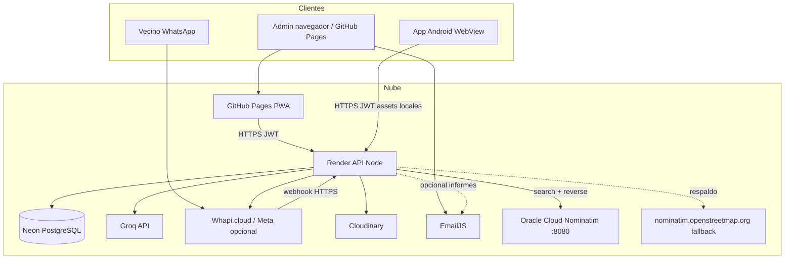
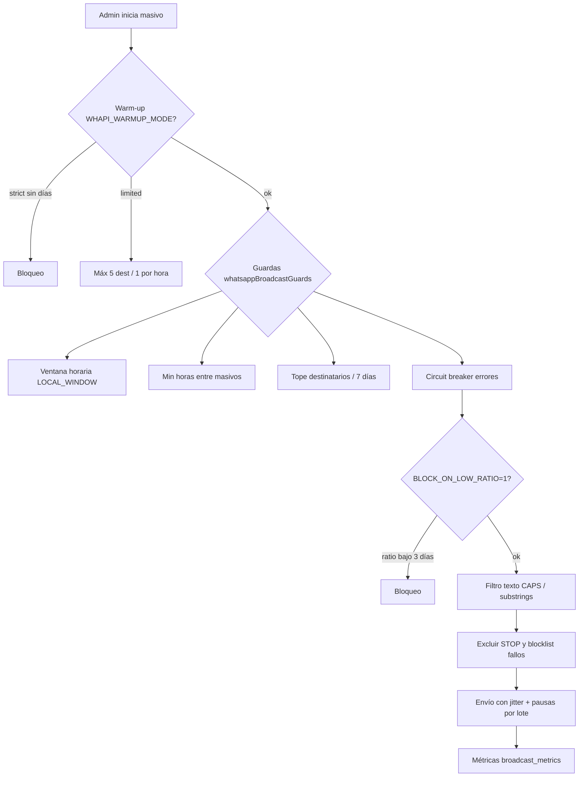

# GestorNova — Documentación técnica (Outlier)

**Versión del documento:** mayo 2026  
**Audiencia:** revisión técnica, due diligence, integración o operación del producto.

---

## 1. Resumen de arquitectura

GestorNova es una plataforma **multitenant** de gestión de reclamos con tres superficies que comparten la misma lógica de negocio:

| Superficie | Tecnología | Despliegue típico |
|------------|------------|-------------------|
| **Panel administrador** | HTML/CSS/JS (ES modules), PWA, Service Worker | **GitHub Pages** |
| **API backend** | Node.js 18+ (recomendado 22+), Express, ESM | **Render** (Web Service) |
| **App técnicos** | Android (Kotlin), WebView embebido + shell nativa | APK / Play (repo Android) |

**Base de datos:** PostgreSQL en **Neon** (serverless).  
**Medios:** fotos y adjuntos en **Cloudinary**.  
**IA:** **Groq** (API compatible OpenAI, modelo `llama-3.3-70b-versatile`).  
**Correo transaccional (cliente):** **EmailJS** desde el navegador y, opcionalmente, desde el servidor en informes programados.  
**WhatsApp:** proveedor configurable; en producción habitual **Whapi.cloud** (`WHATSAPP_PROVIDER=whapi`).



### Repositorios GitHub

| Repo | Rol |
|------|-----|
| [LEAVERA77/Pedidos-MG](https://github.com/LEAVERA77/Pedidos-MG) | Front público (Pages) + carpeta `api/` desplegada en Render |
| [LEAVERA77/Pedidos-Manteniemiento-Android](https://github.com/LEAVERA77/Pedidos-Manteniemiento-Android) | App Android; fuente habitual de `app/src/main/assets/` (sincronizado a Pedidos-MG) |

Workspace local típico: `AndroidStudioProjects/Nexxo` (Android) y `AndroidStudioProjects/Pedidos-MG` (web).

---

## 2. Infraestructura y servidores

### 2.1 Render (API)

- **Servicio:** Web Service Node (`api/server.js` → `createHttpApp()` en `api/httpApp.js`).
- **Puerto:** `PORT` (default 3000 en local).
- **Health:** `GET /health`, `GET /health/db`, `GET /api/health/deploy` (commit Git si Render lo inyecta).
- **Variables:** definidas en el dashboard de Render (no commitear `.env`). Plantilla: `api/.env.example`.
- **CORS:** `CORS_ALLOWED_ORIGINS` incluye `https://leavera77.github.io` y orígenes de desarrollo.
- **Multitenant por host:** JWT con `tenant_id`; opcional `ENFORCE_TENANT_HOST` + sufijos de subdominio. Para admin en Pages sin subdominio: `TENANT_HOST_FALLBACK_ALLOW_HOSTS=<host-render>.onrender.com`.
- **Rate limiting:** login, verify-password, geocode y API general (`api/middleware/rateLimits.js`).

### 2.2 GitHub Pages (front admin)

- **URL publicada:** `https://leavera77.github.io/Pedidos-MG`
- **Workflow:** `.github/workflows/deploy-pages.yml` en Pedidos-MG (build → artefacto → `deploy-pages`).
- **Build:** copia `index.html`, `app.js`, `modules/*.js`, `sw.js`, estilos, etc. Genera **`config.json`** en CI desde secretos (no va al repo):
  - `NEON_CONNECTION_STRING` — usado por el panel para consultas directas Neon en el navegador (mismo patrón que la PWA histórica).
  - `API_BASE_URL` — base de la API en Render.
  - `EMAILJS_*` — claves públicas de EmailJS para envío desde el cliente.
- **PWA:** `sw.js` con caché de shell (`pmg-shell-v*`) y precarga de módulos ES.

### 2.3 Neon (PostgreSQL)

- **Conexión:** `DB_CONNECTION` / `NEON_CONNECTION_STRING` (cadena PostgreSQL con `sslmode=require`).
- **Acceso desde API:** `api/db/neon.js` (`query()`).
- **Migraciones:** scripts SQL en `api/db/migrations/` (aplicar manualmente o según procedimiento del equipo en Neon).
- **Datos principales:** `clientes` (tenants), `usuarios`, `pedidos`, `socios_catalogo`, `clientes_finales`, `distribuidores`, `distribuidores_red`, `incidencias`, tablas de WhatsApp (`broadcast_*`, métricas), `notificaciones_movil`, `correcciones_direcciones`, etc.
- **Extensiones útiles:** `unaccent`, `fuzzystrmatch` / `levenshtein` en Postgres para búsqueda de nombres en bot (ver migraciones en `api/db/migrations/`).

### 2.4 Geocodificación — Nominatim en Oracle Cloud (search + reverse)

**Documento detallado:** [`docs/NOMINATIM_ORACLE_CLOUD.md`](../NOMINATIM_ORACLE_CLOUD.md)  
**Migración infra:** `MIGRATION_VULTR_TO_ORACLE.md`, `RENDER_ENV_VARS.md`, `MIGRATION_VERIFICATION.md`, `ORACLE_HTTPS_SETUP.md`

El panel y la app **no** llaman a Nominatim en internet de forma directa. Todo pasa por la **API en Render**, que consulta una **instancia propia** de Nominatim desplegada en **Oracle Cloud** (VM + Docker, puerto **8080**). Variable en producción:

```text
NOMINATIM_BASE_URL=http://167.234.235.76:8080
```

(Sin barra final; tras cambiar → redeploy en Render.)

| Capacidad | Endpoint Nominatim (Oracle) | Proxy API (JWT) |
|-----------|----------------------------|-----------------|
| **Forward** — dirección → lat/lng | `GET /search?...` | `POST /api/geocode/nominatim/search` |
| **Reverse** — lat/lng → dirección | `GET /reverse?lat=&lon=&format=json&addressdetails=1` | `POST /api/geocode/nominatim/reverse` |
| Salud / diagnóstico | ping `/search` | `GET /api/geocode/health` |

**Reverse geocoding en el producto (ejemplos):**

- Bot WhatsApp: ubicación GPS del vecino → calle y localidad inferidas (`whatsapp-bot-gps-ubicacion.js`).
- Admin: clic en el mapa al cargar pedido nuevo → rellena formulario vía `/api/geocode/nominatim/reverse`.
- Detalle de pedido: completar provincia / CP si faltan y hay coordenadas (`pedido-detalle-infer-ubicacion-nominatim.js`).
- Validación de domicilio de padrón frente al punto geocodificado (`reverseHitMatchesCatalog` en `nominatimClient.js`).

**Implementación servidor:** `api/services/nominatimClient.js` (throttle ~1,1 s, cabeceras `User-Agent` / `From`, reintentos 406, fallback a `nominatim.openstreetmap.org`). Caché de respuestas en Neon (`geocode_nominatim_cache`) y correcciones manuales (`correcciones_direcciones`). Rate limit en Render: `geocodeRouteLimiter` sobre `/api/geocode`.

**Otras rutas relacionadas:** `/api/whatsapp/geocode`, `/api/direcciones/corregir`, `PUT /api/pedidos/:id/coords-manual`, re-geocodificación (`regeocodificarPedido.js`).

**Operativa Oracle:** abrir puerto **8080** en security lists hacia Render; opcional HTTPS con Caddy (`scripts/oracle/setup_https_caddy.sh`). Host anterior de referencia (Vultr): `45.76.3.146:8080` — ver rollback en `MIGRATION_VULTR_TO_ORACLE.md`.

### 2.5 Cloudinary

- **Uso:** fotos de pedidos, evidencias de cierre, imágenes del bot WhatsApp.
- **Variables:** `CLOUDINARY_CLOUD_NAME`, `CLOUDINARY_API_KEY`, `CLOUDINARY_API_SECRET`.
- **Servicio:** `api/services/cloudinary.js`.

---

## 3. Inteligencia artificial (Groq)

| Parámetro | Valor |
|-----------|--------|
| **Proveedor** | [Groq](https://groq.com) |
| **Endpoint** | `https://api.groq.com/openai/v1/chat/completions` |
| **Modelo habitual** | `llama-3.3-70b-versatile` |
| **Secret en servidor** | `GROQ_API_KEY` (solo backend; nunca en el front) |
| **Límite referencia** | ~1000 req/día en capa gratuita (ver consola Groq) |

La IA **no es obligatoria**: si `GROQ_API_KEY` está vacía, los endpoints devuelven respuestas sin bloqueo fatal o sin recomendación IA.

### 3.1 Usos en la API (`/api/ia/*`)

| Endpoint / módulo | Función |
|-------------------|---------|
| `POST /api/ia/clasificar-reclamo` | Clasifica texto libre → tipo, dirección, prioridad, resumen (`groqClassifier.js`). |
| `POST /api/ia/generar-aviso` | Redacta mensaje para aviso masivo (`groqBroadcastGenerator.js`). |
| `POST /api/ia/analizar-reclamos` | Agrega SQL + recomendación sobre reclamos 30 días (`groqAnalisisReclamos.js`). |
| Análisis técnico asignados | Resumen para cuadrilla (`groqAnalisisTecnicoAsignados.js`). |
| KPIs sugeridos | Propuesta de indicadores (`groqKpiSugeridos.js`). |
| Informes / explicar KPIs | Texto para informes ejecutivos (`groqGenerarInforme.js`, `groqExplicarKpis.js`). |
| Derivación | Borrador de mensaje a tercero (`groqMensajeDerivacion.js`). |

### 3.2 Usos en el bot WhatsApp (servidor)

Módulos bajo `api/services/groqWhatsappBot*.js`:

- **Intención** del mensaje (`groqWhatsappBotIntent.js`).
- **Tipo de reclamo** sugerido (`groqWhatsappBotTipoReclamo.js`).
- **Orientación** conversacional (`groqWhatsappBotOrientacion.js`).
- **Microcopy** opcional en respuestas (`groqWhatsappBotMicrocopy.js`).

Orquestación en `api/services/whatsappBotMeta.js` (nombre histórico; aplica también con adaptador Whapi).

### 3.3 Front (panel)

- Botón **«Analizar con IA»** en Socios (reclamos 30 días) → llama a `/api/ia/analizar-reclamos`.
- Clasificación al cargar pedidos, generación de avisos masivos, informes KPI, etc., vía las mismas rutas con JWT de sesión.

---

## 4. EmailJS

EmailJS envía correo **desde el cliente** (navegador) sin servidor SMTP propio.

| Concepto | Detalle |
|----------|---------|
| **SDK** | `@emailjs/browser` cargado en `index.html` |
| **Config en Pages** | `config.json` generado en GitHub Actions con `EMAILJS_PUBLIC_KEY`, `EMAILJS_SERVICE_ID`, `EMAILJS_TEMPLATE_ID`, `EMAILJS_TEMPLATE_ID_INFORME` |
| **Plantillas unificadas** | `app/src/main/assets/modules/emailjs-plantilla-unificada.js` |
| **Casos de uso** | Código de recuperación de contraseña (6 dígitos); envío manual de informes diario/semanal/mensual desde admin (`admin-reportes-email-ui.js`); opcional payload al API para informes programados en Render |
| **Secretos en Render** | Mismos IDs/claves si el backend envía informes automáticos (`EMAILJS_*` en entorno del API) |

**Importante:** la clave pública EmailJS es visible en el front; el control de abuso depende de límites de EmailJS y de que el envío de informes sensibles requiera sesión admin + API.

---

## 5. WhatsApp — integración y proveedores

### 5.1 Abstracción

`api/services/whatsappService.js` selecciona proveedor según `WHATSAPP_PROVIDER`:

| Valor | Uso |
|-------|-----|
| `whapi` | **Producción habitual** — Whapi.cloud |
| `meta` | WhatsApp Cloud API oficial (Meta Graph) |
| `waha` | Desarrollo local (Docker, WhatsApp Web) |
| `evolution` | Alternativa local (Baileys; no recomendado en Render sin VPS) |

### 5.2 Whapi.cloud (producción)

| Variable | Descripción |
|----------|-------------|
| `WHAPI_API_URL` | `https://gate.whapi.cloud` |
| `WHAPI_API_KEY` | Token del panel Whapi |
| `WHAPI_CHANNEL_ID` | ID de canal → resolución de `tenant_id` (`clientes.whapi_channel_id`) |
| `WHATSAPP_WEBHOOK_TOKEN` | Secreto en query `?token=` del webhook |
| `WHAPI_WEBHOOK_SECRET` | Opcional: header dedicado |

**Webhook entrante:**

```
POST https://<api-render>/api/webhooks/whatsapp/whapi?token=<WHATSAPP_WEBHOOK_TOKEN>
```

Alias: `POST /api/webhooks/whapi/message`.

**Salida:** envío de texto, listas (según capacidad del adaptador), avisos al vecino al cambiar estado del pedido (`PUT /api/pedidos/:id`), derivaciones, masivos.

**Normalización Argentina:** prefijo móvil `549` en envío; coherencia con Meta en recepción (`META_WHATSAPP_ARGENTINA_*` cuando aplica).

### 5.3 Meta Cloud API (alternativa oficial)

- Webhook: `POST /api/webhooks/whatsapp/meta` con verificación GET y firma `X-Hub-Signature-256` (`META_APP_SECRET`).
- Variables: `META_ACCESS_TOKEN`, `META_PHONE_NUMBER_ID`, `META_WEBHOOK_VERIFY_TOKEN`, `META_GRAPH_API_VERSION`.
- Emulador local: `@whatsapp-cloudapi/emulator` + `META_GRAPH_URL` (solo desarrollo; ver `api/README.md`).

### 5.4 Bot conversacional

| Variable | Rol |
|----------|-----|
| `WHATSAPP_BOT_ENABLED` | Activa menú y flujo de alta |
| `WHATSAPP_BOT_TENANT_ID` | Fallback si no hay `channel_id` |
| `WHATSAPP_BOT_MASTER_PHONE(S)` | Activar/desactivar bot global por WhatsApp |
| `WHATSAPP_BOT_DISTRIBUIDOR_CODIGO` | Default al crear pedido desde bot |

Flujo principal: `whatsappBotMeta.js` + módulos de pasos, padrón (`busqueda-nombre-bot.js`), geocodificación, fotos a Cloudinary, creación de `pedidos`.

**Avisos automáticos al socio** (si `origen_reclamo === 'whatsapp'`): mensajes al pasar a *En ejecución*, cambio de avance y cierre — implementados en la API al actualizar pedidos, no en la app Android.

### 5.5 Chat humano (operador)

- Panel admin: dock de chats (`whatsapp-human-chat-admin.js`, API `/api/whatsapp/human-chat`).
- Permite responder manualmente sobre conversaciones ya abiertas con el canal del tenant.

---

## 6. Flujo anti-baneo (masivos y reputación del número)

Documentación operativa: `api/docs/WHAPI_BROADCAST_COMPLIANCE.md`  
Guía Whapi: [mailings sin riesgo de bloqueo](https://support.whapi.cloud/help-desk/blocking/how-to-do-mailings-without-the-risk-of-being-blocked)

### 6.1 Capas de protección



### 6.2 Ritmo de envío (Whapi)

Variables por defecto orientadas a no saturar:

| Variable | Default orientativo |
|----------|---------------------|
| `WHAPI_BROADCAST_DELAY_MIN_MS` / `MAX_MS` | 30 000 – 90 000 ms entre mensajes |
| `WHAPI_BROADCAST_BATCH_EVERY` | Pausa larga cada N envíos (ej. 15) |
| `WHAPI_BROADCAST_BATCH_PAUSE_*` | 120 000 – 300 000 ms |

### 6.3 Opt-in / opt-out (STOP / ALTA)

- Migración: `api/db/migrations/whapi_broadcast_compliance.sql` → columna `socios_catalogo.acepta_avisos`.
- Webhook interpreta **STOP** / baja y **ALTA** / alta; confirma por WhatsApp al vecino.
- Solo afecta filas del **catálogo de socios** con teléfono coincidente (no pedidos sueltos sin match en socios).

### 6.4 Warm-up de número nuevo

| Variable | Efecto |
|----------|--------|
| `WHAPI_WARMUP_MODE` | `off` (default), `strict`, `limited` |
| `WHAPI_WARMUP_DAYS_REQUIRED` | Días desde alta del canal (script `api/scripts/init-whapi-number.js`) |

### 6.5 Métricas y bloqueo por ratio

- Tabla `broadcast_metrics` + respuestas con texto ≥ 6 caracteres.
- `GET /api/whatsapp/broadcast/metrics` (JWT admin): ratio de respuestas, alerta si **&lt; 20 %** durante **3 días seguidos** en ventana de 7 días.
- `WHAPI_BROADCAST_BLOCK_ON_LOW_RATIO=1` → bloquea **nuevos** masivos solo si esa alerta está activa (por defecto **0**, desactivado).

### 6.6 Otras guardas (opcionales, default off)

- `WHAPI_BROADCAST_BLOCKLIST_FAIL_THRESHOLD` — excluir números con N fallos seguidos (`broadcast_phone_failures`).
- `WHAPI_BROADCAST_REJECT_CAPS_PCT` — rechazar textos con demasiadas mayúsculas.
- `WHAPI_BROADCAST_BLOCK_SUBSTRINGS` — palabras repetidas sospechosas.

---

## 7. App Android (técnicos)

| Componente | Detalle |
|------------|---------|
| **Shell** | `MainActivity` + WebView carga assets locales (`app/src/main/assets/`) o URL de Pages según config |
| **Notificaciones** | Cola `notificaciones_movil` en Neon; polling WorkManager ~15 min; polling WebView ~45 s; **FCM opcional** (`api/services/fcmPush.js`) si está configurado |
| **Nativo** | GPS, cámara, permisos, canal de notificaciones Android, actualización de APK (`/api/app-version`) |
| **Offline** | `offline.js` + service worker en web; sincronización al recuperar red |

Misma API y JWT que el panel web; rol técnico / supervisor / admin según usuario.

---

## 8. Seguridad y cumplimiento (resumen)

| Tema | Implementación |
|------|----------------|
| **Autenticación** | JWT (`JWT_SECRET`, expiración `JWT_EXPIRES_IN`) |
| **Autorización** | Middleware `adminOnly`, `tecnicoSupervisorOnly`, `authWithTenantHost` |
| **Multitenant** | `tenant_id` en token y filtrado SQL; host opcional |
| **Webhooks** | Token en query/header; firma Meta; secreto Whapi opcional |
| **Secretos** | Solo en Render / GitHub Secrets; `config.json` en Pages generado en CI (no en git) |
| **Subida de archivos** | Límites body 25 MB; imágenes a Cloudinary |
| **Debug** | Rutas `/api/debug/*` deshabilitadas en producción salvo flags explícitos |

---

## 9. CI/CD y calidad

| Repo | CI |
|------|-----|
| Pedidos-MG | `deploy-pages.yml` (Pages), `api-ci.yml` (tests API si aplica) |
| Nexxo / Android | `api-ci.yml`, tests Vitest en `api/tests/` |

Tests relevantes: `padronBusquedaPedido.test.js`, `groqClassifier.test.js`, `whapiWebhookAdapter.test.js`, etc.

---

## 10. Mapa de rutas API (referencia)

Prefijo habitual: `https://<host-render>/api`

| Prefijo | Área |
|---------|------|
| `/auth` | Login, JWT, recuperación contraseña |
| `/pedidos` | CRUD pedidos, fotos, cierre, coords, avisos WA |
| `/ia` | Groq (clasificar, analizar, informes, avisos) |
| `/whatsapp` | Bot, broadcast, geocode WA |
| `/whatsapp/human-chat` | Chat operador |
| `/webhooks/whatsapp/*` | Entrada Whapi / evolution / waha |
| `/webhooks/whatsapp/meta` | Entrada Meta |
| `/padron-pedido` | Búsqueda padrón para alta pedido |
| `/socios`, `/admin` | Catálogo, import Excel, export |
| `/estadisticas` | KPIs, SAIDI/SAIFI |
| `/geocode` | Nominatim proxy |
| `/notificaciones` | Cola móvil |
| `/clientes`, `/usuarios` | Tenants y usuarios |
| `/incidencias` | Agrupación de reclamos |
| `/reportes-programados` | Informes automáticos |

Listado completo de montaje: `api/httpApp.js`.

---

## 11. Variables de entorno críticas (checklist Render)

```text
# Core
DB_CONNECTION=
JWT_SECRET=
CORS_ALLOWED_ORIGINS=
TENANT_HOST_FALLBACK_ALLOW_HOSTS=

# WhatsApp producción
WHATSAPP_PROVIDER=whapi
WHAPI_API_KEY=
WHAPI_CHANNEL_ID=
WHATSAPP_WEBHOOK_TOKEN=
WHATSAPP_BOT_ENABLED=true
WHATSAPP_BOT_TENANT_ID=

# IA
GROQ_API_KEY=

# Medios
CLOUDINARY_CLOUD_NAME=
CLOUDINARY_API_KEY=
CLOUDINARY_API_SECRET=

# Email (informes servidor)
EMAILJS_PUBLIC_KEY=
EMAILJS_SERVICE_ID=
EMAILJS_TEMPLATE_ID=

# Opcional anti-baneo masivos
WHAPI_BROADCAST_DELAY_MIN_MS=
WHAPI_BROADCAST_BLOCK_ON_LOW_RATIO=0

# Nominatim (Oracle Cloud)
NOMINATIM_BASE_URL=http://167.234.235.76:8080
NOMINATIM_USER_AGENT=
NOMINATIM_FROM_EMAIL=
NOMINATIM_FETCH_TIMEOUT_MS=
NOMINATIM_WHATSAPP_SEARCH_MODE=free-form
```

Plantilla comentada: **`api/.env.example`** (800+ líneas de documentación inline).

---

## 12. Documentación relacionada en el repo

| Ruta | Contenido |
|------|-----------|
| `api/README.md` | Emulador Meta, Evolution, WAHA, Whapi |
| `api/docs/WHAPI_BROADCAST_COMPLIANCE.md` | STOP, warm-up, métricas masivos |
| `api/docs/CAMBIAR_PROVEEDOR_WHATSAPP.md` | Cambio de proveedor WA |
| `docs/presentacion/GestorNova-Cooperativa-Electrica.md` | Presentación funcional cooperativa |
| `docs/presentacion/GestorNova-Municipios.md` | Presentación funcional municipios |
| `docs/NOMINATIM_ORACLE_CLOUD.md` | Nominatim en OCI: search, reverse, Render, caché |
| `MIGRATION_VULTR_TO_ORACLE.md` | Migración geocoder Vultr → Oracle |
| `RENDER_ENV_VARS.md` | `NOMINATIM_BASE_URL` y redeploy Render |
| `docs/NOMINATIM_WHATSAPP_OPERATIVA.md` | Bot WA + variables Nominatim |
| `.cursor/rules/pedidos-repos-arquitectura.mdc` | Paridad Nexxo ↔ Pedidos-MG |

---

## 13. Contacto técnico del producto

- **Repositorios:** LEAVERA77 en GitHub (ver URLs arriba).
- **Atribución en commits del proyecto:** `made by leavera77`.

*Documento preparado para revisión Outlier — GestorNova / Nexxo.*
